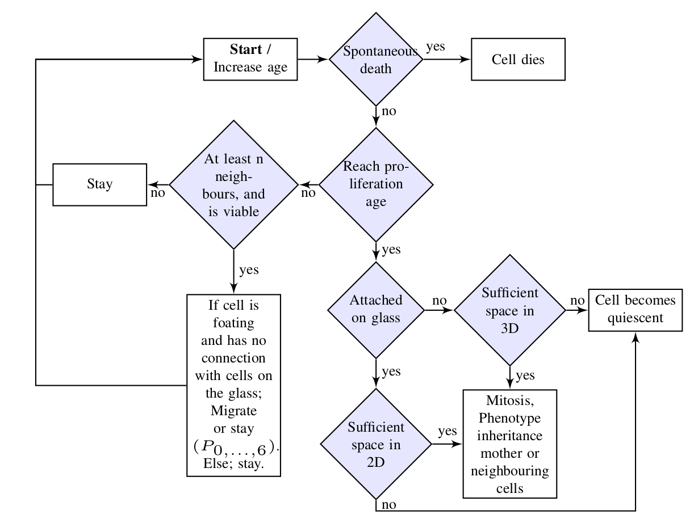

# HyMetaGrowth

Repository for calibration, simulation, and validity assessment of a
Hybrid Discrete-Continuum model of cancer growth with applications in
3D cancer cell cultures (paper).

## Code and data
- The associated code can be found in the repository of [HyMetaGrowth](https://github.com/NMDimitriou/HyMetaGrowth).

- The data associated with this study can be found on the [FigShare repository](https://figshare.com/projects/3D-GROWTH-MDA-MB-231-SERIES-12/118989).

- Details on the data processing and segmentation pipeline can be found [here](https://www.biorxiv.org/content/10.1101/2021.07.29.454312v1).

## Suport or Contact
For any question feel free to contact me at: nikolaos.dimitriou [at] mail.mcgill.ca

## Prerequisites
  - [CUDA version ≥ 10](https://developer.nvidia.com/cuda-downloads)
  - [Π4U package](https://github.com/cselab/pi4u)
  - NVidia GPU with memory ≥ 12 GB (otherwise the resolution of the simulation
    should be reduced)

## Introduction
This framework is related to the spatiotemporal modelling of cancer growth in 3
spatial dimensions and the study of relations between morphological patterns,
and the biophysical mechanisms. The PDE model is constructed based on observations
from 3D cell culture data of Triple-Negative Breast cancer cells cultured in
Matrigel extracellular matrix (ECM). For the purpose of incorporating more details
in the spatial organization and progression of the cancer cells,
the model is hybridized (Discrete - Continuum *or* HDC) according to the techniques
found in Anderson [1], [2] and Franssen et al. [3].

The model is calibrated on the continuum level. The validation is performed
on the hybrid (HDC) level by performing spatial statistical analysis between
experimental and simulation results.

## Structure of repository
### - Points2Density
Converts points with 3D coordinates to spatial density profiles using the
adaptive kernel density estimation via diffusion method [4].

### - Calibration_Continuum
Here we calibrate the continuum model by performing Bayesian Inference using the
Transitional Markov Chain Monte-Carlo (TMCMC) algorithm found in Π4U package.
The `Calibration_Continuum` directory contains the following subdirectories.

- TMCMC: Contains the code of TMCMC algorithm.

- Simulations: Contains the code of the model. To perfrom calibration, copy the `sample`
  binary file from the `TMCMC/` directory here.

    - model: Contains the source code for the simulation of the continuum model.
      To compile the code, run make. The `doall.sh` script is called by the
      TMCMC code. To modify the total number of GPUs used for your study, open this
      script and change the last argument.

- Visualization: Contains the `plot_data.R` script that takes `curgen*.txt` files
of posterior PDFs candidates of each generation and plots the marginal and joint
parameter posterior distributions.

### - Hybrid
Here we simulate the hybrid model. The `Hybrid` directory contains the source
code for the hybrid model. Further instructions can be found in the following
chapters.

### - Spatial_Analysis
This directory contains Matlab and R scripts that perform spatial analysis between
simulated and experimental data.

## Instructions
### Test simulation on the continuum level
1. Go to `Simulations/model`. To enable saving the
simulation results open the `Makefile` and uncomment the the line
`SIMU_OPTION += -DSAVE_DATA`. Then run `make`.

2. Include the model parameters in the `params_test.txt` file.
Note that the model takes 5 parameters (see the mathematical formulation in
the following chapters) + 1 parameter for the experimental error
(recuired for calibration).
The simulation takes place by default in 486×486×176 spatial grid point that
corresponds to 2.5×2.5×0.9 mm^3 space. The simulation time is set to 14. To
change these parameters, feel free to modify the variables found in `main.cu`
and `simulate.cu`.

3. The initial conditions (ICs) for the simulation are found in
`Simulations/IC` directory. The ICs can be the density profiles at day 0 of the
experimental data or your favorite 3D matrix. The ICs should be given in binary
format. In the directory of the ICs you can also include the experimental data
for the calibration of the model. The ICs and experimental data files should have
the same spatial dimensions as your simulation space. The experimental data that
accompany this code correspond to days 0, 2, 5, 7, 9, 12, 14, with day 0 the IC.

4. Once you have set the ICs, the experimental data, and the parameters open
the `doall_test.sh` file. This file executes 3 files; the `main_parent` file
is responsible for loading and unloading the ICs and experimental data to
the shared memory. The `main_parent` file takes the following input format

  >./main_parent < start or stop >   < directory of the ICs and experimental data >    < common prefix of the ICs/data files >

    where the *start* argument loads the data, and the *stop* argument unloads the data.
The accepted filename format for the ICs and experimental data files is
< common prefix >_D#.bin (for example AN_D0.bin for data at day 0, AN_D2.bin
for data at day 2 etc).

  Once the ICs and experimental data are loaded to the shared memory, the `./main`
file runs the simulation. The input arguments for the `./main` file are the following

  `./main < parameter file such as params_test.txt >
  < common perefix of the ICs/data files >  < number of GPUs (must be 1) >`

  the < common prefix of the ICs/data files > is the same as the argument in
`./main_parent` input. In this setup each simulation takes only one GPU, and this
argument should be set to 1.

  Once you have set the `doall_test.sh` you can run it by typing `./doall_test.sh`
in the terminal (make sure that you have execution priviledges before running it).

### Calibration on the continuum level
1. Go to the TMCMC directory and compile the code by running `make`.

2. Copy the `sample` file from the `TMCMC` directory to `Simulations`.

3. Go to `Simulations/model` directory. In the
`Makefile` comment the lines `SIMU_OPTION += -DSAVE_DATA` and
`SIMU_OPTION += -DNRMSE` to make the simulation faster. Compile the code by
running `make`.

4. The `doall.sh` file will be called by the TMCMC algorithm. This file
runs the simulation. Make sure that the `./main` command (in the `doall.sh`)
file has the correct arguments (see previous chapter).

5. Go to `Simulations` directory. To run the calibration in one GPU, simply type

   `./sample`

   If you are in a cluster and you can use more than 1 GPUs, then you can run
the calibration by typing

  `mpirun -np (number of GPUs, e.g. 4) ./sample`

  Example of a SLURM submission script is also provided.
Note that each simulation may take from 1 to 5 minutes in a V100 GPU by NVidia.
Thus, the calibration may take a long time, depending on your resources and
the parametrization.

### Visualization of parameter posterior distributions
1. Go to the `Visualization` directory

2. Open the `plot_data.R` file and modify the fname according the file you want
to open and plot. Then run script in R. The files produced by the TMCMC that have
the pattern
`curgen*.txt` contain the posterior distributions (PDFs) of the candidate
model parameters. The resulted plots are saved in the directory of
the `curgen*.txt` files. The `plot_data.R` script, also, saves the best parameters
found by the TMCMC in a `best_params_< name of TMCMC file >.txt` file.

### Simulation of the Hybrid model
1. Go to the `Hybrid` directory.

2. Compile the code by running `make`.

3. Run the simulator by typing

   `./main < path/to/parameter_file > < common prefix of data (ICs/experiments) >`

The output of the simulation are the files with the coordinates of the cells
and the files containing the number of cells in the corresponding time-points
(the default is day 0, 1, 2, ... 14).

### Spatial Analysis
1. To plot the centroids of both experiments and simulations use the `plot_centroids.m`
Matlab script. The `plot_centroids.m` script splits the time-points of the coordinates
of the simulated cells and saves them in the `scale_coord` directory.

2. The `calcEnv.R` script calculates the *K* function given the coordinates of the
experimental and simulation results. The results can be ploted using the
`Kenv_plot_all.m` script.

3. To estimate the inter-cellular and nearest-neighbour distance distributions
use the `dist_all_s12.m` script.

## Mathematical model
### Keller-Segel with chemotaxis
The Keller-Segel model (originally Keller-Segel-Patlak) is a system of
advection-reaction-diffusion equations. Application of this model can be
found in Biology, especially cancer, and bacterial growth. The mathematical
expression of the model we use is the following:

| Continuum | Discrete |
| ----------- | ----------- |
|ut = DuΔu + su(1-u) - χ∇⋅(u(1-u)∇f)     ft = DfΔf + rfu(1-u)     ∇u⋅n⃗ = ∇f⋅n⃗ = 0  | un+1i,j,k = uni,j,k P0 + uni+1,j,kP1 + uni-1,j,k P2 + uni,j+1,k P3 +      uni,j-1,k P4 + uni,j,k+1 P5 + uni,j,k-1 P6    |

## References
[1] Anderson, A. R. A. (2005). A hybrid mathematical model of solid tumour invasion: the importance of cell adhesion. Mathematical Medicine and Biology: A Journal of the IMA, 22(2), 163–186. http://dx.doi.org/10.1093/imammb/dqi005

[2] Anderson, A. R. A. (2003). A Hybrid Discrete-continuum Technique for Individual-based Migration Models. In W. Alt, M. Chaplain, M. Griebel, & J. Lenz (Eds.), Polymer and Cell Dynamics: Multiscale Modeling and Numerical Simulations (pp. 251–259). Birkhäuser Basel. https://doi.org/10.1007/978-3-0348-8043-5_19

[3] Franssen, L. C., Lorenzi, T., Burgess, A. E. F., & Chaplain, M. A. J. (2019). A Mathematical Framework for Modelling the Metastatic Spread of Cancer. Bulletin of Mathematical Biology, 81(6), 1965–2010. https://doi.org/10.1007/s11538-019-00597-x

[4] Botev, Z. I., Grotowski, J. F., Kroese, D. P., & others. (2010). Kernel density estimation via diffusion. The Annals of Statistics, 38(5), 2916–2957.

## Citing
If you intend to use this code in your publications, please cite:
